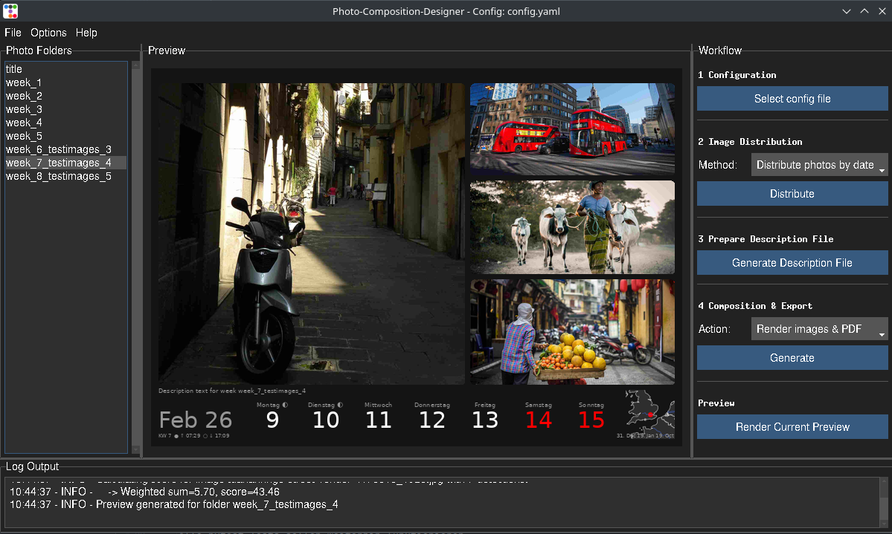
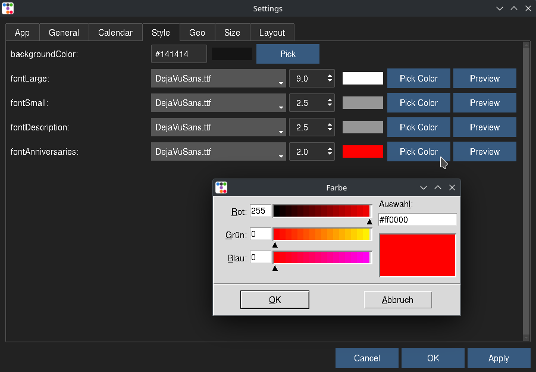
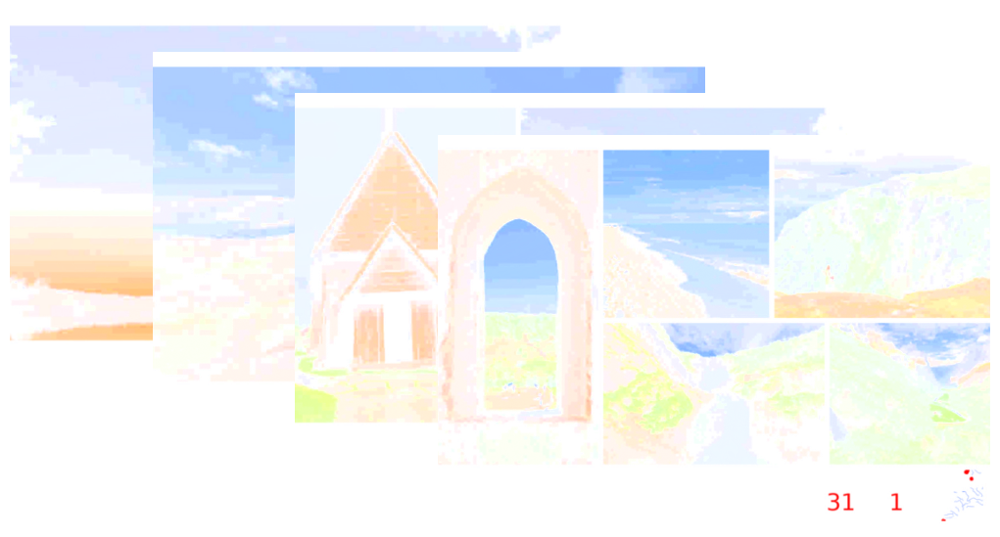

<!-- This README.md is auto-generated from docs/index.md -->

# Welcome to Photo-Composition-Designer

Photo-Composition-Designer is a tool designed to automate the creation of beautiful image-based calendars. The system sorts images, generates collages, adds descriptions and maps, and formats everything into a structured calendar layout.

[](https://github.com/pamagister/Photo-Composition-Designer/actions)
[](https://github.com/pamagister/Photo-Composition-Designer/releases)
[](https://Photo-Composition-Designer.readthedocs.io/en/stable/)
[](https://github.com/pamagister/Photo-Composition-Designer/blob/main/LICENSE)
[](https://github.com/pamagister/Photo-Composition-Designer/issues)
[](https://pypi.org/project/Photo-Composition-Designer/)
[](https://pepy.tech/project/Photo-Composition-Designer/)


## 🛠️ Features

* ✅ **Automated Calendar Generation** – Generates a full image-based calendar.
* ✅ **Configurable Settings** – Modify sizes, layouts, and text via `config.yaml`.
* ✅ **Anniversaries & Events** – Load anniversaries and special dates using `anniversaries.ini`.
* ✅ **Location-Based Maps** – Integrate maps showing image locations using gps meta-data or image names and `locations.ini`.
* ✅ **GUI Configuration Tool** – Easily modify configurations via a dynamic UI.
* ✅ **Folder Management** – Automatically structures and organizes images into necessary folders.
* ✅ **AI Image Analysis** – Smart, content-aware image cropping powered by [Ultralytics YOLO26](https://docs.ultralytics.com/) 
  object recognition to keep the most important parts of every photo in view.



---

## Installation via executable:

Download the latest executable:

- [⬇️ Download for Windows](https://github.com/pamagister/Photo-Composition-Designer/releases/latest/download/photo-composition-designer-win.zip)
- [⬇️ Download for Linux](https://github.com/pamagister/Photo-Composition-Designer/releases/latest/download/photo-composition-designer-linux.zip)
- [⬇️ Download for macOS](https://github.com/pamagister/Photo-Composition-Designer/releases/latest/download/photo-composition-designer-macos.zip)


## Installation via pypi

Get an impression of how your own project could be installed and look like.

Download from [PyPI](https://pypi.org/). For more installation options see [install](docs/getting-started/install.md).

<details open>
<summary>💡 Details PyPI Installation</summary>

```bash
pip install Photo-Composition-Designer
```
or
```bash
pipx install Photo-Composition-Designer
```

Run GUI from command line

```bash
Photo-Composition-Designer-gui
```

</details>


---


## 🔄 Workflow

### 1️⃣ **Configuring the parameters**
You can adjust the result by setting up your own parameters like size, margins and colors.
For more details, see [Configuration Parameters](docs/usage/config.md).
Modify your settings inside the `config.yaml` or using the GUI:
- Image sizes (mm converted to pixels internally)
- Calendar layout
- Paths to `anniversaries.ini` and `locations.ini`
- Fonts and Colors




### 2️⃣ **Sorting Images into Folders**
Organize your images in the `images/` directory before running the generator.
You can use one of the distribution methods to distribute your plain images inside this directory
into sub-folders that represent your weekly collage content.

<details open>
<summary>💡 Details Photo Directory Structure</summary>

```plaintext
📁 images/
├── 📁 title/
│   └── 🖼️ title_image.jpg
├── 📁 week_1/
│   ├── 🖼️ valentines_dinner_in_London.jpg
│   └── 🖼️ ski_trip.jpg
├── 📁 week_2/
│   ├── 🖼️ new_year_hike.jpg
│   ├── 🖼️ cooking_class.jpg
│   ├── 🖼️ first_snowfall.jpg
│   └── ...
└── 📄 descriptions.txt

```

</details>


### 3️⃣ **Provide Descriptions** 🖥️
Provide descriptions for every week to describe the events.

You can use one single `description.txt` file that can be generated using the GUI
or you can put individual txt files into every single weekly sub folder.

<details>
  <summary>💡 Optional control flags</summary>

  The following flags can be added anywhere in the photo description:

  - `[no-calendar]` — prevents a calendar from being generated for this photo.
  - `[no-description]` — suppresses the generated photo description.

  Example:

  ```text
    Family vacation at the beach [no-calendar]
    [no-description]
  ```
</details>


### 4️⃣ **Setting up the birthday dates** 🎂📅
Provide the birthday information of your friends and family by using the `anniversaries.ini`

<details open>
<summary>💡 Details</summary>

```plaintext
[Birthdays]

Paul = 6.1.1984
Peter = 08.01.99
Liz = 09.01.
Anna = 10.01.

[Weddings]
Mary & Josh = 02.01.2021    ; ⚭ Symbol is used for Weddings
```
</details>


### 5️⃣ **Generating the Calendar** 🖼️
Use **Generate Composition** to generate all collages and one PDF file containing all your compositions.



### 6️⃣ **Printing the Calendar** 🖨️
Send the generated PDF to your printer or local print shop for high-quality printing.

A very good print shop for Germany is [WIRmachenDRUCK ](https://www.wir-machen-druck.de/).

---

If you find this app helpful, [Funding](docs/funding/funding.md) is highly appreciated 🧡.